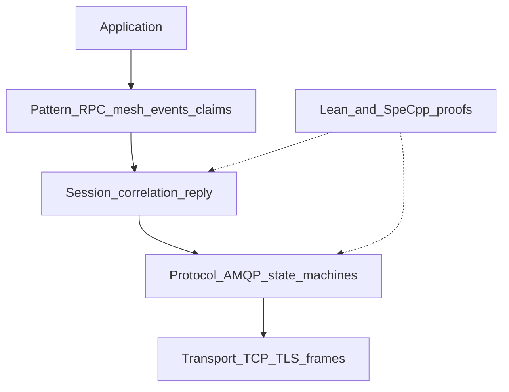
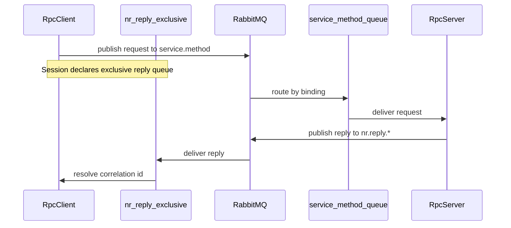
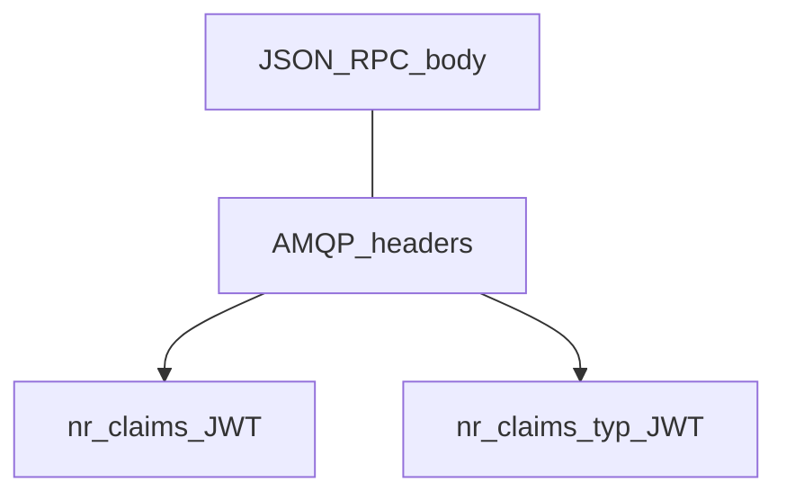
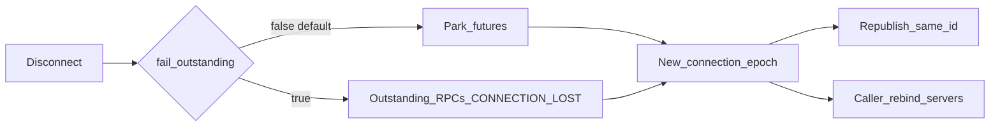

# Architecture overview

A short visual tour for integrators. This page stays at the “what talks to
what” level. Lean ↔ Python correspondence is in
[`specs/lean/CORRESPONDENCE.md`](../../specs/lean/CORRESPONDENCE.md).

## Layer stack

Your code uses **Pattern** APIs (`RpcClient`, `MeshService`, events) or drops
down to **Transport** (`AmqpConnection`). **Session** owns exclusive reply
queues and correlation ids.

There are **two runtimes**. Python (`nuropb_rmq`, asyncio) stays on the 1.0
freeze and does not load Lean. Lean apps `import NuropbRMQ` and talk the same
mesh; that client **imports** the proof kernels (`tryStep`, `tryBind`, HS256)
rather than extracting them. SpeC++ remains a CheckSat gate only. See
[`specs/lean/CORRESPONDENCE.md`](../../specs/lean/CORRESPONDENCE.md) (Runtime).

## Mesh RPC path

Clients wait on a per-connection exclusive reply queue. Services bind only
under their `service.method` namespace. Broker ACLs must allow services to
publish replies — see [Broker permissions](../guides/broker-permissions.md).

## AMQPS connect

Material can come from files, in-memory PEM, PKCS#12, or a `tls_secrets` hook
(re-run on every `connect()`). Profile **`tls-verify-full`** checks chain and
hostname. `EXTERNAL` is used only when the broker advertises it **and** a
client cert is configured — never assume mTLS alone means passwordless.
Details: [TLS profiles and material](tls-profiles-and-material.md) and
[Cloud AMQPS](../guides/cloud-and-enterprise-amqps.md).

## Claims on the wire

Application auth rides in AMQP **headers** only; the JSON-RPC body stays
spec-pure. Servers with `AuthConfig` fail closed on missing or unbound tokens.
See [JWT claims](jwt-claims.md).

## Reconnect (1.0)

Default reconnect **parks** in-flight client RPCs and republishes after a new
exclusive reply queue. Fail-fast (`fail_outstanding=True`) completes outstanding
calls with `CONNECTION_LOST`. After reconnect you must still rebind mesh
consumers and restart servers. See [Reconnect](reconnect.md).

Publisher confirms and `connection.blocked` fail-fast (no silent stall) are part
of the same robustness story — see queue profiles and connection config docs.

## Next

- [Service mesh](service-mesh.md) — what “mesh” means here
- [Connection config](connection-config.md)
- Runnable demos:
  [`examples/one_client_one_service/`](../../examples/one_client_one_service/)
  (Python mesh RPC + events),
  [`examples/lean_mesh/`](../../examples/lean_mesh/)
  (Lean ↔ Lean mesh),
  [`examples/interop_hello/`](../../examples/interop_hello/) and
  [`examples/interop_mesh/`](../../examples/interop_mesh/)
  (Lean ↔ Python),
  [`examples/langchain_example/`](../../examples/langchain_example/)
  (LangChain tool; Python-only),
  [`examples/langgraph_example/`](../../examples/langgraph_example/)
  (LangGraph remote node + reconnect; Python-only)
