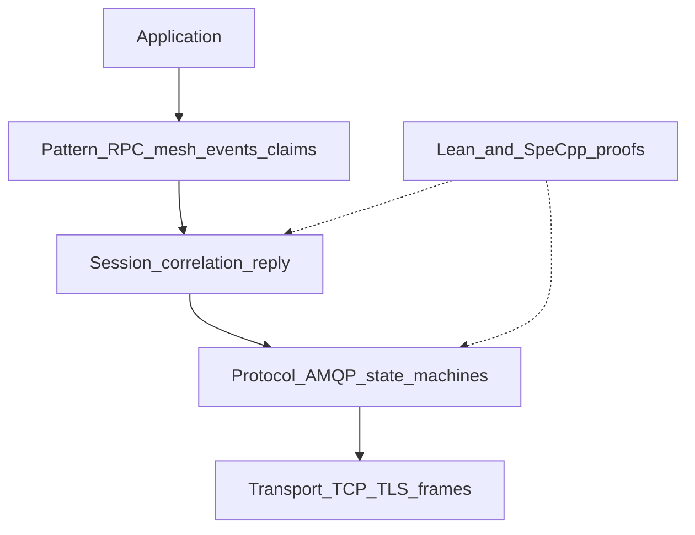
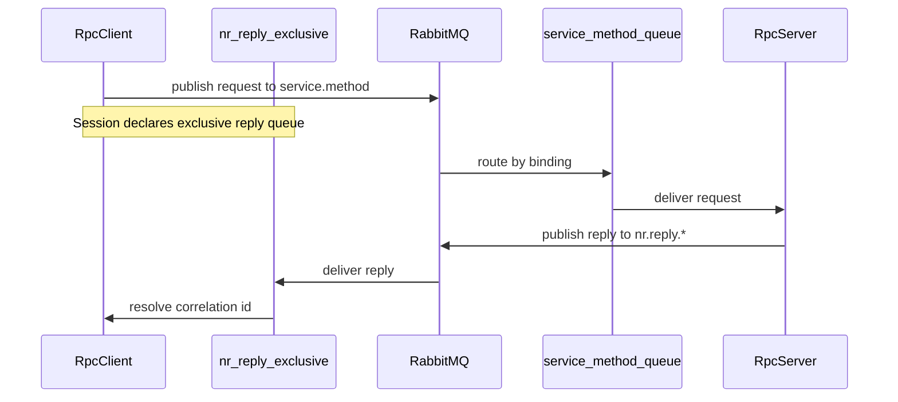
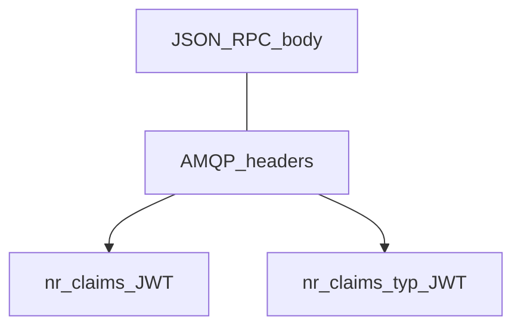
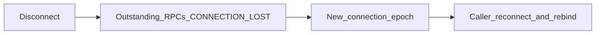

# Architecture overview

A short visual tour for integrators. Deep design decisions live in
[`thinking/architecture.md`](../../thinking/architecture.md) — this page stays
at the “what talks to what” level.

## Layer stack

Your code uses **Pattern** APIs (`RpcClient`, `MeshService`, events) or drops
down to **Transport** (`AmqpConnection`). **Session** owns exclusive reply
queues and correlation ids. **Lean / SpeC++** are parallel proof artifacts —
they are not a runtime dependency.

## Mesh RPC path

Clients wait on a per-connection exclusive reply queue. Services bind only
under their `service.method` namespace. Broker ACLs must allow services to
publish replies — see [Broker permissions](../guides/broker-permissions.md).

## AMQPS connect

Material can come from files, in-memory PEM, PKCS#12, or a `tls_secrets` hook
(re-run on every `connect()`). Profile **`tls-verify-full`** checks chain and
hostname. `EXTERNAL` is used only when the broker advertises it **and** a
client cert is configured — never assume mTLS alone means passwordless.
Details: [TLS profiles and material](tls-profiles-and-material.md) and
[Cloud AMQPS](../guides/cloud-and-enterprise-amqps.md).

## Claims on the wire

Application auth rides in AMQP **headers** only; the JSON-RPC body stays
spec-pure. Servers with `AuthConfig` fail closed on missing or unbound tokens.
See [JWT claims](jwt-claims.md).

## Reconnect (v1)

There is no silent park-and-retry of in-flight RPCs. After reconnect you must
rebind mesh consumers and restart servers. See [Reconnect](reconnect.md).

Publisher confirms and `connection.blocked` fail-fast (no silent stall) are part
of the same robustness story — see queue profiles and connection config docs.

## Next

- [Service mesh](service-mesh.md) — what “mesh” means here
- [Connection config](connection-config.md)
- Runnable mesh demo: [`examples/one_client_one_service/`](../../examples/one_client_one_service/)
