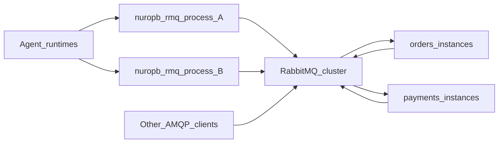

# Adaptability & scalability

Internal technical–marketing note: why nuropb-rmq’s architecture adapts across
services, languages, and agent runtimes, and how it scales horizontally
without a prefork concurrency model. Positioning companion:
[`opportunities-marketing.md`](opportunities-marketing.md). Architecture depth:
[`architecture.md`](architecture.md); intent and trust boundary:
[`project-intent.md`](project-intent.md).

---

## Thesis

**In-process: proudly single-threaded asyncio.** One event loop owns connect,
publish, consume, and RPC — less shared-memory concurrency complexity than
prefork / thread / greenlet pools.

**Across the system: scale out through RabbitMQ.** Add more asyncio service
(or agent) processes; the broker routes `service.method` RPC and topic/fanout
events. Durability, clustering, and consumer distribution inherit from
RabbitMQ’s production model — not from reinventing a worker fleet inside this
library.

**Adaptability** comes from AMQP 0-9-1 + JSON-RPC 2.0 envelopes: other
frameworks and languages on the same broker can publish and consume without
importing nuropb. Security adapts via TLS profiles, mTLS / SASL `EXTERNAL`,
and optional JWT claims on RPC.

---

## Concurrency model (feature, not limitation)

| Choice | Consequence |
|---|---|
| asyncio throughout | `await` connect / publish / consume / RPC in the same loop as FastAPI (etc.) |
| No prefork / billiard / eventlet pool | No separate worker-process deployment for the mesh path |
| No kombu-style multi-broker abstraction | RabbitMQ-only; simpler mental model, deliberate trade-off |
| Fail-fast reconnect | Outstanding RPCs fail with `CONNECTION_LOST`; caller rebinds mesh consumers |

Celery’s concurrency menu (prefork, eventlet, gevent, threads, solo) has **no
native asyncio pool**. For asyncio-native apps, that usually means a sync
worker fleet beside the app, or greenlet monkey-patching. nuropb’s bet is the
opposite: keep concurrency simple in-process; let the broker fan work out.

This is not a claim that one asyncio process saturates a cluster. It is a
claim that **the unit of scale is another process (or another service
instance), not another thread inside the client.**

---

## Horizontal scale model



**What scales how**

1. **More consumers / service replicas** — RabbitMQ distributes deliveries
   across consumers on a shared queue; run N identical `MeshService` (or
   `RpcServer`) processes for a `service.method` binding.
2. **More distinct services** — namespaced binds (`orders.*`, `payments.*`);
   broker ACL profile `mesh-bind-namespaced` is the hard gate; discovery never
   authorizes.
3. **More connections / nodes** — RabbitMQ clusters tolerate node loss with
   odd-sized clusters (3, 5, 7…) and benefit from spreading connections;
   quorum queues improve HA and can deliver from local replicas
   ([RabbitMQ production checklist](https://www.rabbitmq.com/docs/production-checklist)).
4. **Event fan-out** — topic/fanout exchanges for progress and domain events
   without coupling publishers to subscriber process counts.

**What we inherit from the broker (do not re-prove)**

- Message durability, replication, and crash recovery under quorum / mirrored
  policies configured by ops.
- Routing-table consistency and partition behaviour of the cluster.
- Throughput ceilings of a single queue (ops often scale by sharding queues /
  keys, not by one infinite queue).

Trust boundary language lives in [`project-intent.md`](project-intent.md):
Lean/SpeC++ cover client protocol/session/pattern logic given correct AMQP
permissions — not broker authorization or cluster HA.

---

## Adaptability / interop

### Wire and envelope

| Layer | Interop surface |
|---|---|
| Transport | AMQP 0-9-1 frames over TCP/TLS — any compliant client can share the broker |
| Pattern body | JSON-RPC 2.0 (`method`, `params`, `id`, `result`, `error`, notifications) |
| Mesh routing | `service.method` routing keys on the shared mesh exchange (default `nr.mesh`) |
| Claims | JWT in AMQP headers (`nr.claims`); body stays spec-pure |

A Go, Java, or Node service does not need this Python package to call or be
called on the fabric if it speaks the same routing keys and envelope
conventions. Today there is **no multi-language SDK** — interop is
protocol-level, which is the intentional bridge to other frameworks.

JSON-RPC alignment also keeps a door open to MCP / A2A custom transports
(both sanction non-HTTP bindings while preserving message semantics). That is
an adaptability option, not a shipped adapter — see
[`opportunities-marketing.md`](opportunities-marketing.md) wedge 4.

### Mesh vs sidecar meshes

Application mesh over RabbitMQ adapts to environments where you already operate
a broker (cloud AMQPS, on-prem, hybrid) without deploying a service-mesh data
plane. Authorization stays with broker ACLs + optional JWT; registry announce
is discovery-only
([`docs/concepts/service-mesh.md`](../docs/concepts/service-mesh.md)).

### Intentional AMQP subset

Adaptability does **not** mean full AMQP management parity with pika. Declared
non-goals (e.g. `basic.get`, Tx, purge/delete admin) keep the client surface
auditable and aimed at continuous-consume + declare-your-own topology.
v0.2.0 closed the gaps that mattered for durable publish/consume and poison
messages (confirms, nack/reject, `connection.blocked`, body fragmentation).
Details: [`amqp-completeness-v0.2.0-vs-pika.md`](amqp-completeness-v0.2.0-vs-pika.md).

---

## Delivery & failure adaptability

| Mechanism | Role under load / failure |
|---|---|
| Publisher confirms | Durable profiles await broker ack/nack; outstanding futures fail on connection loss |
| `connection.blocked` / `unblocked` | Fail-fast refuse publishes (`ConnectionBlockedError`) instead of silent buffer growth |
| `basic.nack` / reject + DLX | Poison-message path (`NackDelivery` on RPC) |
| Named queue profiles | `durable-at-least-once` default pairs durable queues with persistent delivery mode |
| Fail-fast reconnect | Clear pending; bump epoch; **caller** `mesh.rebind()` — explicit recovery, no hidden dual paths |
| Broker TTL / DLX timeouts | Authoritative request timeout when the broker provides it (client timer only when mutually exclusive fallback applies) |

These make the fabric adaptable to broker pressure and bad messages without
turning the library into a generic retry/orchestration framework. Application
idempotency remains the author’s responsibility for at-least-once delivery —
same as any AMQP consumer.

---

## Security adaptability

| Concern | Library posture |
|---|---|
| Transport | Named TLS profiles (`tls-verify-full`, custom SAN, insecure-dev); PEM / PKCS#12 / secrets hook |
| Client auth to broker | SASL `PLAIN` or `EXTERNAL` when advertised **and** client cert present — never assume mTLS ⇒ passwordless |
| Who may bind / publish replies | Broker ACL profiles (`mesh-bind-namespaced`, `reply-publish-restricted`); client-side `assert_bind_allowed` as guardrail only |
| Who may invoke a method | Optional JWT claims on RPC (`[claims]` extra): `exp`, `jti` = correlation id, `method` = RPC method; fail-closed |

For agent → backend meshes, JWT claim binding is the adaptability lever:
rotate tokens, bind method and correlation, keep JSON-RPC bodies boring and
interoperable. Issuance/revocation stay with the IdP — outside Lean scope.

---

## Agent task execution fit

Agents are a **workload shape**, not a new product category for this library.

```text
Agent runtime (LangGraph node, custom loop, A2A executor)
  → RpcClient.request(service, method, params, claims_token=...)
    → RabbitMQ routes service.method
      → MeshService / RpcServer handler on a backend fleet
        → optional events for progress / completion notifications
```

Why it fits:

- **Durable call path** — confirms + reply queues survive longer than an
  in-process `await` to a local function when the callee is another service.
- **Horizontal backends** — scale the service mesh instances independently of
  the agent process count.
- **Claim-based auth** — each tool/backend call can carry a bound JWT.
- **Events** — progress without coupling to a proprietary tracer.

Why it is not a job framework:

- No beat scheduler, no canvas/chord DAG, no persisted result-backend zoo.
- Long-running “fire and check later” belongs to Celery/Temporal/etc., or to
  an agent checkpointer — possibly **alongside** this mesh in the same stack.

Reconnect ownership for idle agents (hours between steps, broker restart
mid-idle) sits with the adapter: fail-fast is correct for proof-friendly
singular outcomes; park-and-retry would be a second path and is intentionally
not the default.

---

## What we claim vs do not claim

**Claim**

- Horizontal scale of service routing and event delivery via more asyncio
  processes × RabbitMQ routing.
- Lower in-process concurrency complexity than prefork/greenlet worker models
  for the RPC/event path.
- Interop adaptability through AMQP + JSON-RPC conventions.
- Proof fabric over protocol/session/pattern state machines (SpeC++ + Lean),
  including reconnect fail-fast and mesh bind guards as modeled.

**Do not claim**

- Higher task-orchestration throughput than Celery at canvas/beat workloads
  (out of category).
- That Lean proofs cover broker HA, quorum consensus, or network partitions.
- That one single-threaded process replaces a scaled consumer fleet.
- Classic event-sourcing store semantics (replay log, projections) — this is
  an **event fabric**, not an event store.
- Production battle-tested scale parity with decade-old task queues (alpha).

---

## Sources

**Internal**

- [`opportunities-marketing.md`](opportunities-marketing.md)
- [`project-intent.md`](project-intent.md)
- [`celery-competitor-assessment.md`](celery-competitor-assessment.md)
- [`langchain-langgraph-opportunity-assessment.md`](langchain-langgraph-opportunity-assessment.md)
- [`amqp-completeness-v0.2.0-vs-pika.md`](amqp-completeness-v0.2.0-vs-pika.md)
- [`docs/concepts/service-mesh.md`](../docs/concepts/service-mesh.md)
- [`docs/concepts/reconnect.md`](../docs/concepts/reconnect.md)
- [`docs/concepts/queue-profiles.md`](../docs/concepts/queue-profiles.md)
- [`docs/concepts/jwt-claims.md`](../docs/concepts/jwt-claims.md)
- [`specs/lean/CORRESPONDENCE.md`](../specs/lean/CORRESPONDENCE.md)

**External**

- RabbitMQ production deployment / clustering considerations:
  https://www.rabbitmq.com/docs/production-checklist
- Quorum queues local delivery (consumer locality under scale):
  https://www.rabbitmq.com/blog/2020/06/23/quorum-queues-local-delivery
- MCP custom transports:
  https://modelcontextprotocol.io/specification/2025-11-25/basic/transports
- A2A custom protocol bindings:
  https://a2a-protocol.org/dev/topics/custom-protocol-bindings/
